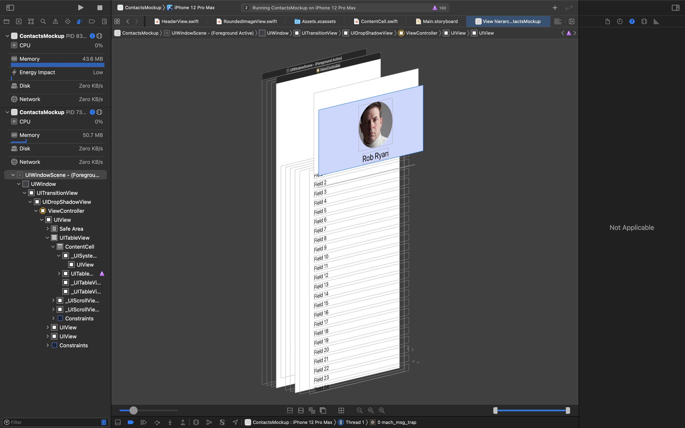
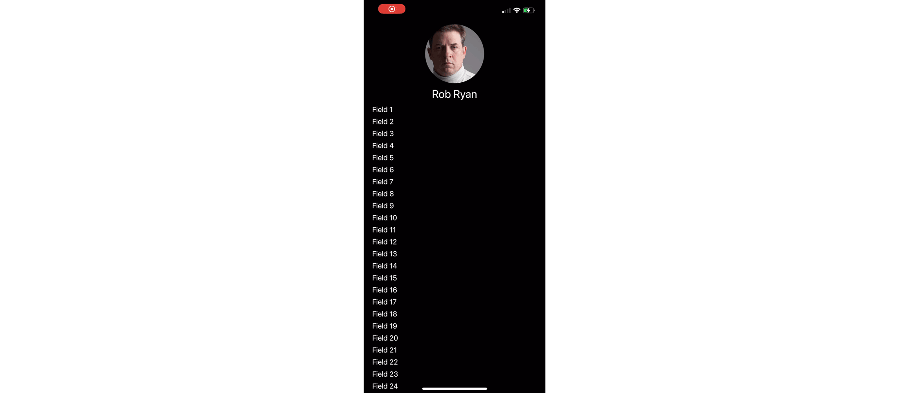

#  Mockup of iOS Contacts app animation

See https://stackoverflow.com/q/65713555/1271826.

There are a few moving parts here:

1. To have the top portion stay there as you scroll on the bottom, just
have one view for the top for the header, and another for the scrollable view below 
it. Make sure the top view is above the scroll view in the view hierarchy, the
header view will remain visible as the scroll view scrolls content behind it. E.g.

    

2. Set the scroll view so its `clipsToBounds` is false. That way, as content scrolls
up above the bounds of the table view, you will still see it. And as long as the top
header view is above the table view in the view hierarchy, the content that scrolls up
will disappear behind the “header” view which is above it in the view hierarchy.

3. To have the top view resize as you scroll on the scroll/table view, add a
`UIScrollViewDelegate` method and update the height of the top view based upon
the `contentOffset` in the table view.

    ```
    // MARK: - UIScrollViewDelegate

    extension ViewController: UIScrollViewDelegate {
            func scrollViewDidScroll(_ scrollView: UIScrollView) {
            let offset = min(scrollView.contentOffset.y, maxHeight - minHeight)
            heightConstraint?.constant = maxHeight - offset

            ...
            }
    }
    ```

4. To have the text change size as the size of this top view changes, you can do this 
in the subview. Or you can do it right in this `scrollViewDidScroll`, too:

    ```
    // MARK: - UIScrollViewDelegate

    extension ViewController: UIScrollViewDelegate {
        func scrollViewDidScroll(_ scrollView: UIScrollView) {
            let offset = min(scrollView.contentOffset.y, maxHeight - minHeight)
            heightConstraint?.constant = maxHeight - offset

            let percent = 1 - offset / (maxHeight - minHeight)
            profileLabel.font = UIFont.systemFont(ofSize: minPointSize + (maxPointSize - minPointSize) * percent)
        }
    }
    ```

5. To have the image view change size as the size of its superview does, just add a few
relevant constraints and settings:

    - top constraint to the top of its superview;
    - bottom constraint of the image view to the top of the label;
    - bottom constraint of the label to its superview;
    - set aspect ratio of the image view to be 1:1;
    - set horizontal anchor to the horizontal anchor of its super view; and
    - set the image view’s content mode to be aspect fit scale.

    Then the image view will automatically resize as its super view’s height changes.

Pulling that all together yields:



---

14 January 2021

Copyright © 2021 Robert M. Ryan. All Rights Reserved.

See [License](LICENSE.md).
